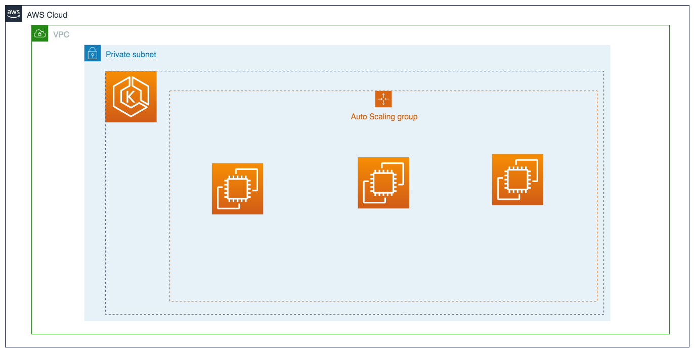

# simple

Create EKS Cluster and EKS Worker Node

## Architecture

## Resources

- three public subnets
- three private subnets
- NAT Gateway per availability zone
- Launch EKS Worker Node in Private Subnets using AutoScaling Group
- EKS Cluster
- CloudWatch Log Group for EKS Cluster

## Quick start

1. Open `variables.tf` and check values
2. change variables
3. Run `terraform init`
4. Run `terraform apply`

check if worker nodes register themselves to cluster

5. Run `aws eks update-kubeconfig --name ${EKS_CLUSTER_NAME}`
6. Run `kubectl config use-context $(aws eks describe-cluster --name ${EKS_CLUSTER_NAME} --query 'cluster.arn' --output text)`
7. Run `kubectl get nodes` 

